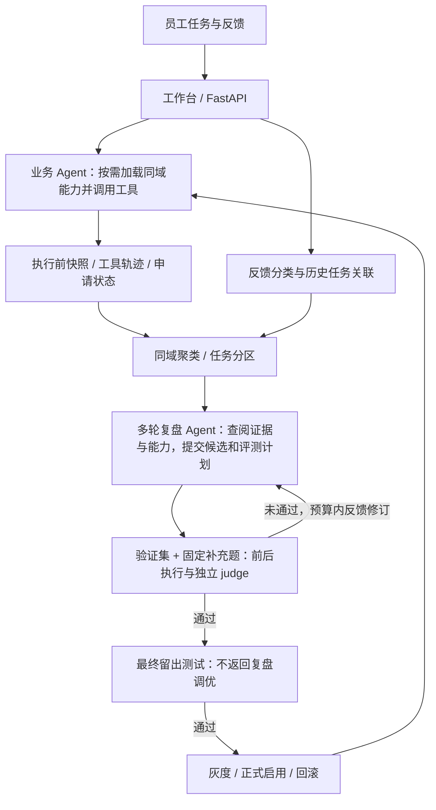

# 星桥 · 行政助手 Agent 与能力进化框架

面向入职办理、权限申请和报销检查的行政业务 Agent。系统依据当前制度调用工具办理任务，并从执行轨迹和用户反馈中发现反复出现的问题，提出 Skill／只读组合工具的新增、修订或淘汰建议，经前后对照评测后进入灰度。

项目重点是 **如何让 Agent 的改进有依据、可验证、可回滚**。当前行政工作台使用结构化任务和本地模拟业务接口；实现了能力进化的完整生命周期，尚未接入真实企业的审批、支付或权限写入系统。

## 主要成果

| 测量对象 | 基线 → 改进后 | 改善及条件 |
|---|---|---|
| 反馈类型识别，48条开发题 | 42/48 → 44/48 | 87.5% → 91.7%，提高 **4.2个百分点**；调整上下文和分类提示 |
| 反馈关联历史任务，同一开发集 | 40/48 → 43/48 | 83.3% → 89.6%，提高 **6.3个百分点** |
| 入职任务，历史冻结测试 | 22/32 → 31/32 | 68.8% → 96.9%，提高 **28.1个百分点**；修复9条、无新增错误 |
| 当前进化流程 | 81项相关回归测试通过 | 验证多轮查阅、失败后修订、评测隔离、灰度和回滚；尚无该版本的真实模型能力增益测量 |

**归因区别**：前两项是反馈模块的人工迭代收益；入职提升来自历史实验中“向同一业务模型提供生成的 Skill”的对照。它们不是最新框架整体的统一准确率，也不是生产业务成功率。[结果与逐条评分摘录](docs/evaluation/results.json)

## 技术方案

当前行政服务采用 **Next.js 工作台 + FastAPI + SQLite 持久化作业与轨迹 + 模型原生工具调用**。业务执行、反馈识别、复盘生成和结果评审使用不同职责的模型调用；Python 负责记录、能力边界、评测执行和发布状态。

### 1. 业务事实与模型推理分开

任务包含 `domain`、用户需求及员工／材料／政策的结构化环境。模型通过 `read_task`、`read_policy` 获取事实，通过 `create_request` 和 `finish_task` 办理与结束任务；调用和返回进入标准的 `assistant/tool` 消息序列，并保存当时的结果快照。

行政示例工具保留允许的申请类型与参数校验；通用运行和评测逻辑不硬编码审批、缺材料或写入失败应对应的业务状态。运行器保存原始结果与错误，由judge依据任务政策判断业务正确性；框架检查执行完整性、调用协议与证据引用。政策不由Skill改写。当前政策由任务环境提供，真实企业制度库和材料抽取的接入属于尚未完成的部分。

### 2. 从反馈发现问题，而不把投诉当成错误结论

小模型识别 `possible_error / preference / none`，关联具体历史任务。按业务域分组后，以问题向量进行余弦 DBSCAN 聚类；最近500条任务中，簇至少20条、至少3条不同任务有疑似错误信号，才触发复盘。

复盘同时查看普通任务和疑似失败任务，核对政策、工具结果和申请状态。例如“申请正确地等待审批，但用户要求立即开通”不应产生绕过审批的策略。相同任务被重复投诉不会重复增加疑似错误任务数；未变化的历史簇不重复复盘。

### 3. 同域能力目录与联合生成

框架从目录读取同业务域的有效 Skill 和工具，由业务模型依据适用说明按需选择。复盘可选择 `create / revise / select / retire`，也可以返回 `no_change / maintenance`；不要求每轮都新增能力。

复盘 Agent 使用原生工具调用，多轮查找同域能力目录、读取 Skill 正文／组合步骤、底层工具 schema 和发现集执行证据，再决定创建、修订、调整选择说明或停止。程序检查引用的任务和相关能力已经读取，拒绝正文或步骤完全相同的重复新增。

**候选改动、评判标准和补充案例由同一个 Agent 联合提交**。首版提交后冻结评测计划；验证未通过时，Agent 可读取逐条前后轨迹与 judge 依据，再修改候选，不能更换标准或题目。默认最多3版候选、整个周期最多16轮复盘模型调用，也可主动停止。每版都与原有效能力比较，复用同一验证基线执行。首轮无需变更或仅需维护时不生成计划。标准须依据原始制度和用户需求，不能以“是否照着新 Skill 执行”代替业务正确性。

工具生成限定为最多4步的只读组合，可使用 `read_task / read_policy / list_materials`；分页循环、页数上限和错误传播由执行器实现。模型不生成任意可执行代码，也不会自动修改数据库或基础设施配置。

### 4. 独立评审与发布生命周期

同类历史按任务ID稳定划分为发现、验证和留出分区，比例约60%／20%／20%。首版候选只读取发现集；后续可利用验证反馈修订。模型生成的补充题只加入验证阶段。验证通过后才运行最终留出测试，留出失败直接拒绝，不把留出内容返回复盘继续调优。

每个评测任务从相同执行前快照分别运行原有与候选能力目录。judge 收到原始任务、政策、A/B完整轨迹和冻结的评判标准，匿名交换组别顺序，输出通过／失败／无法判断及证据路径。程序校验证据存在并拒绝未完成的执行，不按具体业务字段覆盖judge的业务结论。该评测边界以无员工、申请、审批字段的交付物案例进行了协议测试；业务执行器本身仍是行政示例。

当前验收要求足够的可判断样本、修复数大于退步数，并确认候选确实被使用。默认灰度比例10%，观察目标20个任务、最长14天；新任务使用实际执行加隔离对照评审，收益不足不转正式，明显退步可回滚。上述是当前实现与默认配置，不是已积累的生产灰度成绩。

## 测评设计与结果

### 反馈识别：测“有没有理解用户在反馈什么”

自建120条合成反馈：3个业务域，每域8种基础反馈，每种5个表达或上下文变体；开发48条、测试72条。每条提供目标历史任务、干扰任务、用户消息及正确类别与关联ID。场景覆盖抱怨、表达偏好、新请求、成功反馈、引用他人失败以及跨任务干扰。

开发发现两类错误：把引用的失败当成本人反馈；看到“仓库权限”就关联另一条权限任务。随后增加业务域上下文、明确新请求与呈现偏好的区别，并补充引用文本反例。开发分类从42/48提升到44/48，关联从40/48提升到43/48；最终反馈测试分类 **67/72（93.1%）**，需要关联历史的45条中关联正确 **43/45（95.6%）**。

模型为 Qwen3-8B。开发与测试共享基础反馈模板，变体主要改变表达前缀和上下文顺序；以上衡量信号识别，不等于真实员工反馈的泛化能力。

### 行政业务：根据反馈改进后，能否把新任务办得更准确？

这组实验验证完整的改进流程：先让 Agent 办理入职、权限申请和报销任务，再根据模拟用户反馈复盘，提出 Skill 修改或新的只读组合工具，最后用另外的任务检查改动是否有效、是否引入新的错误。实验在自建模拟环境中进行，没有真人参与，也没有连接真实企业业务系统。以下为历史实验 `controlled-05` 的结果。

**题目如何构造、如何使用**

共构造288条业务任务，覆盖上述三个业务域，包括材料齐全、缺少材料、已有申请、政策变化、材料分页和接口故障等情况。每条任务都提供用户需求、员工信息、材料、政策、已有申请，以及用于评分的独立标准答案。任务环境预先构造，具体工具调用和失败轨迹由模型执行产生。

任务分为学习、验证和最终测试三组，每组96条：

| 数据用途 | 本轮如何使用 |
|---|---|
| 学习组 | 固定选取72条（每域24条）实际执行，得到47条正确、25条失败的历史轨迹，再由模拟用户生成反馈，供 Agent 复盘和提出改动 |
| 验证组 | 每个业务域32条；在相同任务上比较原有能力与加入候选改动后的表现，决定是否接受候选 |
| 最终测试组 | 每个业务域32条；通过验证的候选再接受冻结测试，测试结果不用于继续修改候选；未通过验证的业务保留基线结果，不额外运行候选 |

这里的“学习”是利用执行记录和反馈改进 Skill 或工具。72条指业务任务数量，不是72次能力修改。

**一条测评数据长什么样**

下面是验证集中的真实合成任务 `039f04b5b97f846cf4aa`，按原始记录概括展示。它已经计入权限业务的32条验证任务，不是额外样本。

| 数据部分 | 该任务的内容 |
|---|---|
| 用户需求 | “为云杉员工4-1申请档案中资源的权限。” |
| 员工与环境 | 正式员工、后端工程师，有负责人；资源类别为普通，但资源名称为空；材料和已有申请均为空 |
| 相关政策 | 权限只能申请，不能直接开通；缺负责人或资源名称时先询问，不建单 |
| 标准答案（供评分使用） | 不创建申请；缺项为资源名称（`resource`）；业务状态为待补充信息（`needs_information`） |
| 原有能力的实际执行 | 读取任务和政策后，多次尝试加载未授权的 Skill，耗尽8次工具调用预算，未完成任务，判失败 |
| 提供候选 Skill 后的执行 | 读取任务和政策、加载候选 Skill，最终要求补充资源名称，没有创建申请；全部检查通过 |

这条任务计为一次“修复”。权限候选在另一条任务上引入了错误，因此整体仍被拒绝。[查看该题完整输入、标准答案、前后工具轨迹及逐项评分](backend/evaluation/controlled-v1/example-validation-fix-039f04b5b97f846cf4aa.json)；[查看全部288条题目](backend/evaluation/controlled-v1/cases.json)。

**如何判断办理正确**

评分检查实际执行结果，包括执行是否完成、申请类型、材料缺项、业务状态、读取证据，以及是否重复申请或越权；全部检查通过，才把该任务计为正确。正常等待审批，或遇到接口故障后正确报告受阻，也可以得分。例如，材料不齐时应先询问；如果已经提交申请，即使最后回复提到补材料，仍然判错。

业务执行与复盘使用 DeepSeek V3.2，反馈分类使用 Qwen3-8B，向量模型为 Qwen3-Embedding-8B。本轮由程序对照标准答案评分，与当前服务使用模型 judge 的方式不同。

**改进前后的结果**

“改进前”使用原有能力；“改进后”向 Agent 提供复盘生成的候选 Skill 或工具。下面的分数均为**正确任务数／该组任务总数**；修复指原本失败、改后正确，新增错误指原本正确、改后失败。

| 阶段 | 业务及候选改动 | 改进前 | 改进后 | 修复任务数 | 新增错误数 | 验收结果 |
|---|---|---:|---:|---:|---:|---|
| 验证 | 入职：Skill 改动 | 24/32 | 31/32 | 7 | 0 | 通过，进入最终测试 |
| 验证 | 权限：Skill 改动 | 28/32 | 31/32 | 4 | 1 | 拒绝 |
| 验证 | 报销：新增工具 | 6/32 | 22/32 | 18 | 2 | 拒绝 |
| 最终测试 | 入职：通过验证的 Skill 改动 | 22/32 | 31/32 | 9 | 0 | 隔离实验接受 |

本轮验收要求“修复至少一条任务，且不引入新错误”，区别于当前实现的净提升门槛。因此，报销虽然净增加16条正确任务，仍因把原本正确的2条任务办错而被拒绝。一个实际反例是：新工具已经读取到用途说明和行程单，Agent 却仍将它们判断为缺失。[查看该反例的完整记录](backend/evaluation/controlled-v1/example-validation-regression-5dd8a7ef67962c0acb00.json)。

最终只有入职候选通过验收，未生产发布。以上结果来自合成业务，每个对照条件仅运行一次，不同数据组仍共享业务机制；尚未验证真实企业任务和多次运行下的稳定收益。[详细实验设置与完整结果](backend/evaluation/controlled-v1/evaluation-report.md)；[历史评分计数与来源哈希](docs/evaluation/results.json)。

### 最新版本验证范围

当前流程通过81项直接相关的离线回归测试，覆盖Skill／工具候选、现有能力查阅与复用、验证失败后二次修订、候选预算、评测计划冻结、补充题来源校验、留出隔离、judge未知或错误证据、非行政字段评审、失败续跑、灰度、正式启用与回滚。测试使用模型替身验证工程行为，没有重新调用付费模型测能力提升。

当前结果支持“特定合成业务中候选有可测收益，验收能暴露副作用”；最新联合生成相对分离流程的业务增益、judge与人工判定的一致性、真实企业迁移和生产收益尚未测量。

## 代码导航

| 关键部分 | 实现 |
|---|---|
| 业务工具循环与接口边界 | [agent.py](backend/app/enterprise/agent.py) |
| 执行快照、反馈与后台作业 | [service.py](backend/app/enterprise/service.py) |
| 反馈分类与同域聚类 | [feedback.py](backend/app/enterprise/feedback.py)、[mining.py](backend/app/enterprise/mining.py) |
| 联合生成、版本与灰度生命周期 | [evolution.py](backend/app/enterprise/evolution.py) |
| 多轮查阅、提案与验证反馈修订 | [authoring.py](backend/app/enterprise/authoring.py) |
| 补充题校验、独立judge与执行完整性 | [assessment.py](backend/app/enterprise/assessment.py) |
| 受限只读工具执行器 | [tool_builder.py](backend/app/enterprise/tool_builder.py) |
| 生命周期回归测试 | [test_internal_evolution.py](backend/tests/test_internal_evolution.py) |

仓库保留早期文档问答和研发诊断模块，但本页聚焦当前行政任务与能力进化。旧企业离线脚本已移出运行目录；历史结果以只读摘录保留，不作为当前服务的出题入口。需要本地演示时可参考 [启动脚本](start-support.ps1) 和 [环境变量模板](.env.example)。
